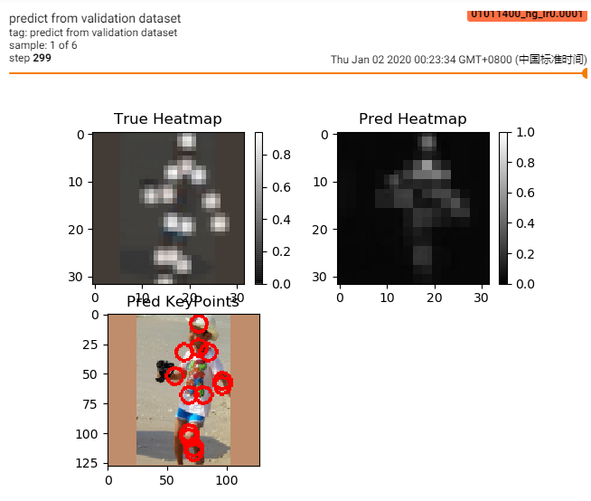
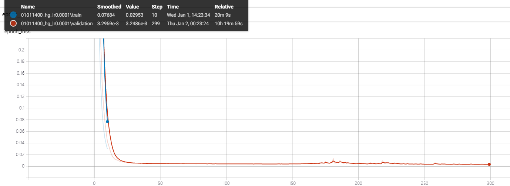
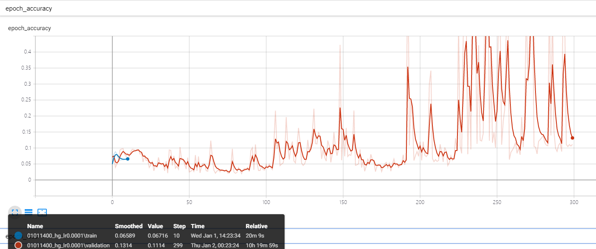
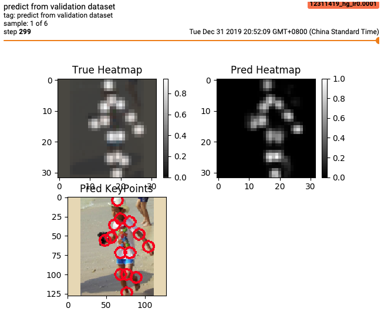

# 💃 Pose Estimation for TensorFlow 2.0

> This repository is forked from [tucan9389/tf2-mobile-pose-estimation](https://github.com/tucan9389/tf2-mobile-pose-estimation) when the original repository doesn't work and the author have no plan to update it, so i fork it and do some research for study purposes.

> Even though I made the orginal model worked. But the final result was not as good as I expected. So I import another model from [yuanyuanli85/Stacked_Hourglass_Network_Keras](https://github.com/yuanyuanli85/Stacked_Hourglass_Network_Keras). This model can train a better model than previous one. Model details can be found in the file models/hourglass_model_v2.py.

This repository currently implemented the Hourglass model using TensorFlow 2.0 (and Keras API). Instead of normal convolution, inverted residuals (also known as Mobilenet V2) module has been used inside the model for **real-time** inference.

## Table of contents

- [Goals](#goals)
- [Getting Started](#getting-started)
- [Results](#results)
- [Converting To Mobile Model](#converting-to-mobile-model)
- [Tuning](#tuning)
- [Details](#details)
  - [Folder Structure](#folder-structure)
  - [Main Components](#main-components)
- [TODO](#todo)
- [Related Projects](#related-projects)
- [Acknowledgements](#acknowledgements)
- [Reference](#reference)
- [Contributing](#contributing)
- [License](#license)

## Goals

- 📚 Easy to train
- 🏃‍ Easy to use the model on mobile device

## Getting Started

### Install Anaconda (~10 min)

- [How To Install Anaconda on Ubuntu 18.04 [Quickstart]](https://www.digitalocean.com/community/tutorials/how-to-install-anaconda-on-ubuntu-18-04-quickstart)
- [How to Install Anaconda on CentOS 7](https://linuxize.com/post/how-to-install-anaconda-on-centos-7/)

### Create Virtual Environment (~2 min)

Create new environment.

```shell
conda create -n {env_name} python={python_version} anaconda
# in my case
# conda create -n mpe-env-tf2-alpha0 python=3.7 anaconda
```

Start the environment.

```shell
source activate {env_name}
# in my case
# source activate mpe-env-tf2-alpha0
# the newest conda version may use command(on my mac): conda activate {env_name} ## from 2019-12-31
```

### Install the requirements (~1 min)

```shell
cd {tf2-mobile-pose-estimation_path}
pip install -r requirements.txt
```

## Run The Project

In order to use the project you have to:

1. Prepare the dataset([ai_challenger dataset](https://drive.google.com/open?id=1zahjQWhuKIYWRRI2ZlHzn65Ug_jIiC4l)) and locate the dataset on `./datasets`.
2. Run the model using:

```shell
python train.py
```

or run HourglassModel version 2 using:

```shell
python train.py --model=hourglass_v2
```

3. Monitoring with TensorBoard:

```shell
tensorboard --logdir="./outputs/logs"
```

## Results

### hourglass_model.py

- loss reduced to around 0.0030, it's working, but not good enough.





### hourglass_model_v2.py

- loss reduced to around 0.0016, this model performs better.



## Converting To Mobile Model

### TensorFLow Lite

1. Prepare the trained model(`.hdf5`) from section below [Run The Project](#run-the-project)
2. Modify `trained_model_file_name` variable in `convert_to_tflite.py` to your own trained model.

```python
trained_model_file_name = "{model_file_name}.hdf5"
```

3. Run the `convert_to_tflite.py`:

```shell
python convert_to_tflite.py
```

4. And then, you can find the `.tflite` model on `{PROJECT_PATH}/outputs/models/tflite/{model_file_name}.tflite`.

## Details

### Folder Structure

```
├── train.py            - the main script file
├── data_loader.py
├── data_augment.py
├── data_prepare.py
├── model_config.py
├── network_base.py
├── path_manage.py
├── train_config.py
├── requirements.txt
├── models
|   ├── hourglass_model.py
|   └── hourglass_model_v2.py
├── datasets            - this folder contain the datasets of the project.
|   └── ai_challenger
|       ├── ai_challenger_train.json
|       ├── ai_challenger_valid.json
|       ├── train
|       └── valid
└── outputs             - this folder will be generated automatically when start training
    ├── models
    └── logs
```

## TODO

- ~~Save model(`.hdf5` or `.ckpt`)~~
- ~~Convert the model(`.hdf5` or `.ckpt`) to TFLite model(`.tflite`)~~
- Add a demo to check if the model is ok to use.
- Run the model on Android
- Run the model on iOS
- Make DEMO gif running on mobile device
- multi-person estimation

## Acknowledgements

This project is based on [tucan9389/tf2-mobile-pose-estimation](https://github.com/tucan9389/tf2-mobile-pose-estimation).

## Reference

[1][paper of convolutional pose machines](https://arxiv.org/abs/1602.00134) <br/>
[2][paper of stack hourglass](https://arxiv.org/abs/1603.06937) <br/>
[3][paper of mobilenet v2](https://arxiv.org/pdf/1801.04381.pdf) <br/>
[4][repository poseestimation-coreml](https://github.com/tucan9389/PoseEstimation-CoreML) <br/>
[5][repository of tf-pose-estimation](https://github.com/ildoonet/tf-pose-estimation) <br>
[6][devlope guide of tensorflow lite](https://github.com/tensorflow/tensorflow/tree/master/tensorflow/docs_src/mobile/tflite) <br/>
[7][mace documentation](https://mace.readthedocs.io)

### Related Projects

- [tucan9389/tf2-mobile-pose-estimation](https://github.com/tucan9389/tf2-mobile-pose-estimation)
- [tucan9389/PoseEstimation-CoreML](https://github.com/tucan9389/PoseEstimation-CoreML)
- [tucan9389/KeypointAnnotation](https://github.com/tucan9389/KeypointAnnotation)
- [edvardHua/PoseEstimationForMobile](https://github.com/edvardHua/PoseEstimationForMobile)
- [jwkanggist/tf-tiny-pose-estimation](https://github.com/jwkanggist/tf-tiny-pose-estimatio)
- [dongseokYang/Body-Pose-Estimation-Android-gpu](https://github.com/dongseokYang/Body-Pose-Estimation-Android-gpu)

### Other Pose Estimation Projects

- [cbsudux/awesome-human-pose-estimation](https://github.com/cbsudux/awesome-human-pose-estimation)

## Contributing

Any contributions are welcome including improving the project.

# License

[Apache License 2.0](LICENSE)
